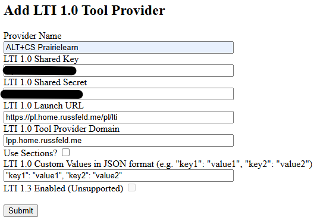
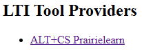
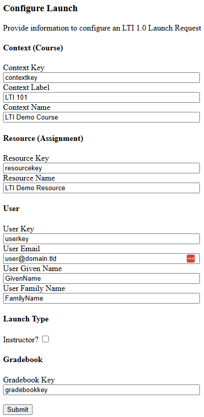
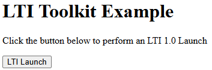
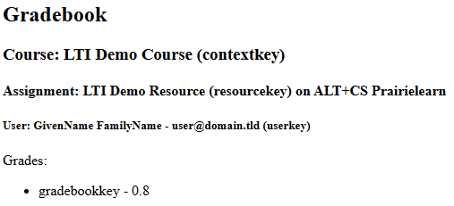

A fully-featured LTI Tool Consumer example can be found in `/examples/consumer`. This document will walk through the details of how that application works.

## Environment

The application expects the following environment variables (typically loaded from `.env`): 

```env {title=".env"}
# Express Session Secret
SESSION_SECRET=your_session_secret

# Log Level
# One of error warn info http verbose lti debug sql silly
LOG_LEVEL=lti

# Application Domain Name
DOMAIN_NAME=https://ltidemo.home.russfeld.me

# LTI Tool Consumer Settings
ADMIN_EMAIL=admin@domain.tld
DEPLOYMENT_NAME=LTI Toolkit Demo
DEPLOYMENT_ID=deployment-001
```

## LTI Toolkit Configuration

The `src/configs/lti.js` file contains a minimal configuration for the LTI Toolkit for use as an LTI 1.0 Tool Consumer:

```js {title="src/configs/lti.js"}
/**
 * @file Configuration information for LTI Toolkit
 * @author Russell Feldhausen <russfeld@ksu.edu>
 * @exports lti an LTI Toolkit instance configured for this app
 */

// Import LTI Toolkit
import LTIToolkit from "lti-toolkit";

// LTI Post Provider Grade Handler
import postProviderGrade from "../routes/post-grade.js";

// Initialize LTI Toolkit
const lti = await LTIToolkit({
  // Domain name for this application
  domain_name: process.env.DOMAIN_NAME,
  // Logging Level
  log_level: process.env.LOG_LEVEL || "silly",
  // Use In-memory database for testing
  db_storage: ":memory:",
  // Consumer Configuration
  consumer: {
    // Incoming grade handler
    postProviderGrade: postProviderGrade,
    // LTI Tool Consumer Information
    admin_email: process.env.ADMIN_EMAIL,
    deployment_name: process.env.DEPLOYMENT_NAME,
    deployment_id: process.env.DEPLOYMENT_ID,
  },
});

export default lti;
```

It configures a default LTI 1.0 Tool Consumer using the domain provided in the environment. It also configures the log level and tells the system to use an in-memory database instance. In addition, it provides some configuration information about the LTI 1.0 Tool Consumer using the information provided in the environment. Finally, it directs the library to the `postProviderGrade` function provided by one of the routes as the handler for incoming LTI grade passback.

## Integrating Application Routes

The `app.js` file creates a basic [Express](https://www.npmjs.com/package/express) application with a minimal set of libraries and configuration.

```js {title="app.js"}
// Import LTI configuration
import lti from "./configs/lti.js";

// Other imports here

// Create Express application
var app = express();

// Other configuration here

// Add LTI Toolkit Routes
app.use("/lti/consumer", lti.routers.consumer);
```

The details of that file are omitted (_read the source, you must_), but the notable configuration is shown above. The configured LTI Toolkit is imported, and then the LTI Provider Router is connected to the application at the `/lti/consumer` path. So, any incoming requests sent to that URL will be passed to the LTI Toolkit for handling. This matches the default route in the toolkit configuration; if this route is changed, it must also be provided in the configuration.

## Adding an LTI 1.0 Tool Provider

Once the application is launched, the first step is to add an LTI 1.0 Tool Provider from the homepage. Each LTI 1.0 Tool Provider is a little different, so consult the instructions for adding that provider to your LMS. Currently this application only supports manually configured tools (configuration via XML is not currently supported).

Required settings:

* **Provider Name** - a memorable name for the LTI Tool Provider
* **LTI 1.0 Shared Key** - the shared key used with this provider
* **LTI 1.0 Shared Secret** - the shared secret used with this provider
* **LTI 1.0 Launch URL** - the launch URL for the LTI Tool Provider.
* **LTI 1.0 Tool Provider Domain** - the domain for the LTI Tool Provider
* **Use Sections?** - enable if the LTI Tool Provider requires special section configuration
  * Currently this does nothing in the library itself, but may be useful for applications implementing LTI Tool Consumer functionality
* **LTI 1.0 Custom Values** - set custom values for the LTI 1.0 Launch Request (currently unsupported)
* **LTI 1.0 Enabled** - enable LTI 1.3 Tool Providers (currently unsupported)

An example configuration for connecting to [PrairieLearn](https://www.prairielearn.com/) is shown below:



LTI 1.0 Tool Providers are added to the system using the `Provider` controller as shown in the `configure` handler.

```js {title="src/routes/configure.js"}
/**
 * Handle LTI Tool Provider Configuration
 *
 * @param {Object} req - the Express request object
 * @param {Object} res - the Express response object
 */
async function ProviderConfigHandler(req, res) {
  let error = null;
  let message = null;

  // Get Form Data
  const data = {
    name: req.body.name,
    // LTI 1.3 is not supported
    lti13: false,
    key: req.body.key,
    secret: req.body.secret,
    launch_url: req.body.launch_url,
    domain: req.body.domain,
    // custom values are unsupported in this example
    custom: "",
    // use_section is optional
    use_section: req.body.use_section === "true",
  };

  // Check if any required fields are missing
  const requiredFields = ["name", "key", "secret", "launch_url", "domain"];
  const missingFields = requiredFields.filter(
    (field) => !data[field] || data[field].trim() === "",
  );
  if (missingFields.length > 0) {
    error = "Missing required fields: " + missingFields.join(", ");
  } else {
    // Create Provider
    try {
      await lti.controllers.provider.createProvider(data);
    } catch (err) {
      error = "Failed to create provider: " + err.message;
    }
    if (!error) {
      message = "Successfully created provider.";
    }
  }

  // Get list of configured tool providers
  const providers = await lti.controllers.provider.getAll();

  // Get secrets for each provider and convert to JSON-friendly format
  const providerData = [];
  for (const provider of providers) {
    const providerSecret = await lti.controllers.provider.getSecret(
      provider.id,
    );
    providerData.push({ ...provider.toJSON(), secret: providerSecret });
  }

  // Render index view
  res.render("index.njk", {
    title: "LTI Tool Consumer - Index",
    domain: process.env.DOMAIN_NAME,
    providers: providerData,
    error,
    message,
  });
}
```

Once an LTI 1.0 Tool Provider is configured, it will be listed on the index page. Click the link to access it.



## Configuring an LTI 1.0 Launch Request

A fully-configured LTI 1.0 Launch Request requires several pieces of information. Generally this information is part of the internal functionalty of the learning management system (LMS) that is implementing LTI 1.0 Tool Consumer functionality. For this example, we instead just use hand-entered values to simulate this process. In an actual LMS, most of this data would already be present.

For all of the items listed below, the **key** values should not be the sequentially autogenerated database IDs, as that may leak internal data from the LMS and allow malicious users to guess other valid values. Intead, these values should be unique and randomly generated, such as [UUIDs](https://en.wikipedia.org/wiki/Universally_unique_identifier) or similar, but they should be consistent (i.e. a key should uniquely identify an item, and that item should always use the same key). Internally, this library uses the [nanoid](https://www.npmjs.com/package/nanoid) package to generate random ID values. 

* **Context** - Generally, the context of an LTI launch refers to a course in the LMS
  * **Key** - a uniquely identifiable key for the course
  * **Label** - a short label for the course (e.g. "LTI 101")
  * **Name** - a long name for the course (e.g. "LTI Demo Course")
* **Resource** - A resource in an LTI launch refers to a specific assignment within the LMS
  * **Key** - a uniquely identifiable key for the assignment
  * **Name** - a long name for the assignment (e.g. "LTI Demo Assignment")
* **User** - Information about the user for the LTI launch. This tool does not currently support anonymous LTI launches.
  * **Key** - a uniquely identifiable key for the user
  * **Email** - the email address associated with the user. Most LTI Tool Providers use the email address to uniquely identify users within their own systems. 
  * **Given Name** - the given name, sometimes referred to as the first name, of the user
  * **Family Name** - the family name, sometimes referred to as the last name or surname, of the user
* **Launch Type** - currently this tool only supports launching as either an "Instructor" or "Learner" role
* **Gradebook Key** - a uniquely identifiable key for the gradebook line item. This can be used to differentiate between individual launches to the same LTI Tool Provider, or to differentiate between launches to different LTI Tool Providers using the same context and resource keys.

This sample application provides default values for all of these options in the form to configure the launch. 



Once the launch is configured, click the "Submit" button to prepare the LTI 1.0 Launch page. This is handled by the `provider-launch` handler in the demo application. In short, it collects all of the form data and constructs the parameters for the `generateLTI10FormData` function in the LTI controller:

```js {title="src/routes/provider-launch.js"}
/**
 * Provider Launch Handler for LTI Tool Consumer
 *
 * @param {Object} req - the Express request object
 * @param {Object} res - the Express response object
 */
async function ProviderLaunchHandler(req, res) {
  let error = null;
  let message = null;

  const providerId = req.params.id;

  // Get Provider
  const provider = await lti.controllers.provider.getById(providerId);
  if (!provider) {
    return res.status(404).send("Provider not found");
  }

  // Get Secret
  const providerSecret = await lti.controllers.provider.getSecret(provider.id);

  // Formatted provider including secret
  const providerData = provider.toJSON();
  providerData.secret = providerSecret.secret;

  // Get Form Data
  const data = {
    context: {
      key: req.body.context_key,
      label: req.body.context_label,
      name: req.body.context_name,
    },
    resource: {
      key: req.body.resource_key,
      name: req.body.resource_name,
    },
    user: {
      key: req.body.user_key,
      email: req.body.user_email,
      given_name: req.body.user_given_name,
      family_name: req.body.user_family_name,
      name: req.body.user_given_name + " " + req.body.user_family_name,
    },
    manager: req.body.manager === "true",
    gradebook_id: req.body.gradebook_id,
  };

  // Check if any required fields are missing
  const requiredFields = [
    "context.key",
    "context.label",
    "context.name",
    "resource.key",
    "resource.name",
    "user.key",
    "user.email",
    "user.given_name",
    "user.family_name",
    "manager",
    "gradebook_id",
  ];
  const missingFields = requiredFields.filter((field) => {
    // Handle nested fields
    const fieldParts = field.split(".");
    let value = data;
    for (const part of fieldParts) {
      value = value[part];
      if (value === undefined) {
        return true;
      }
    }
    return (
      value === undefined || value === null || value.toString().trim() === ""
    );
  });
  if (missingFields.length > 0) {
    error = "Missing required fields: " + missingFields.join(", ");

    // Render provider view
    res.render("provider.njk", {
      title: `LTI Tool Consumer - Provider: ${provider.name}`,
      provider: providerData,
      error: error,
      message: message,
    });
  } else {
    // Store launch data in local data store
    updateDataStoreWithLaunch(data, providerData, req);

    // Create LTI Launch
    const launch = lti.controllers.lti.generateLTI10FormData(
      providerData.key,
      providerData.secret,
      providerData.launch_url,
      "/provider/" + providerData.id,
      data.context,
      data.resource,
      data.user,
      data.manager,
      data.gradebook_id,
    );

    // Render template
    res.render("launch.njk", {
      launch,
    });
  }
}
```

The `generateLTI10FormData` function returns an object with 2 attributes:
* `action` : the LTI Launch URL to send the request to
* `fields` : a set of fields to be sent in the LTI Launch

## Sending an LTI Launch Request

LTI 1.0 Launch Requests must be sent by the user's browser. The easiest way to do this is by constructing a form on the webpage with only hidden fields, and then having the user click a button to submit the form to the LTI Launch URL of the LTI 1.0 Tool Provider. The form can also be configured to submit automatically if desired. 

The `launch.njk` template demonstrates how to generate this page using the [Nunjucks](https://www.npmjs.com/package/nunjucks) template engine. 

```njk {title="src/views/launch.njk"}
<form method="POST" action="{{ launch.action }}">
  
  <input type="hidden" id="{{ attr }}" name="{{ attr }}" value="{{ value }}" />
  
  <input type="submit" value="LTI Launch">
</form>
```

Below is another helpful example for creating a similar page using a [Vue.js](https://vuejs.org/) component:

```vue
<template>
  <div id="auto-form">
    <form v-if="form" :action="form.action" method="POST">
      <input
        v-for="(value, key) in form.fields"
        :key="key"
        :name="key"
        :value="value"
        type="hidden"
      />
      <Button type="submit" label="Launch Lesson" severity="primary" />
    </form>
  </div>
</template>
```

Using the settings configured above, an LTI Launch page would contain the following object:

```json 
{
  "fields": {
    "oauth_consumer_key": <redacted>,
    "oauth_signature_method": "HMAC-SHA1",
    "oauth_timestamp": "1769290880",
    "oauth_nonce": "URY5gH_jRTpDDTsCH2MXP",
    "oauth_version": "1.0",
    "context_id": "contextkey",
    "context_label": "LTI 101",
    "context_title": "LTI Demo Course",
    "launch_presentation_document_target": "iframe",
    "launch_presentation_locale": "en",
    "launch_presentation_return_url": "/provider/1",
    "lis_outcome_service_url": "https://ltidemo.home.russfeld.me/lti/consumer/grade_passback",
    "lis_result_sourcedid": "contextkey:resourcekey:userkey:gradebookkey",
    "lis_person_contact_email_primary": "user@domain.tld",
    "lis_person_name_family": "FamilyName",
    "lis_person_name_full": "GivenName FamilyName",
    "lis_person_name_given": "GivenName",
    "lti_message_type": "basic-lti-launch-request",
    "lti_version": "LTI-1p0",
    "oauth_callback": "about:blank",
    "resource_link_id": "resourcekey",
    "resource_link_title": "LTI Demo Resource",
    "roles": "Learner",
    "tool_consumer_info_product_family_code": "lti-toolkit",
    "tool_consumer_info_version": "cloud",
    "tool_consumer_instance_contact_email": "admin@domain.tld",
    "tool_consumer_instance_guid": "deployment-001",
    "tool_consumer_instance_name": "LTI Toolkit Demo",
    "user_id": "userkey",
    "oauth_signature": <redacted>
  },
  "action": "https://pl.home.russfeld.me/pl/lti"
}
```

The resulting page:



Click the button to lanuch the LTI 1.0 Tool Provider.

## Handling Grade Passback

At any time, the LTI 1.0 Tool Provider may provide updated grade information to our example program. That is received at the `grade_passback` route in the LTI Consumer Router, and then sent to the `postProviderGrade` function provided in the toolkit configuration as shown above. For this example program, this is handled in the `post-grade` handler:

```js {title="src/routes/post-grade.js"}
/**
 * LTI 1.0 Grade Passback Handler for LTI Tool Consumer
 *
 * @param {string} providerKey the provider key
 * @param {string} contextKey the context (course) key
 * @param {string} resourceKey the resource (lesson or assignment) key
 * @param {string} userKey the user (student) key
 * @param {string} gradebookKey the gradebook key
 * @param {number} score the score to post (0.0 - 1.0)
 * @param {Object} req the Express request object
 */
async function postGradeHandler(
  providerKey,
  contextKey,
  resourceKey,
  userKey,
  gradebookKey,
  score,
  req,
) {
  // Store grade in the local data store
  updateLocalDataStoreWithGrade(
    req,
    contextKey,
    resourceKey,
    userKey,
    gradebookKey,
    score,
  );

  // No need to return anything; library assumes success here
}
```

This function is called with a number of helpful parameters:

* `providerKey` - the shared key for the LTI 1.0 Tool Provider, which can be used to look up the provider in the `Provider` controller with the `getByKey` method.
* `contextKey` - the unique key for the context (course) in the original LTI launch
* `resourceKey` - the unique key for the resource (assignment) in the original LTI launch
* `userKey` - the unique key for the user in the original LTI launch
* `gradebookKey` - the unique key for the gradebook line item in the original LTI launch
* `score` - the grade received, as a floating-point value between 0.0 and 1.0
* `req` - the original Express request object

This should be enough information to properly record the grade in the LMS gradebook. In this example application, it is just stored in an in-memory object for short-term tracking. 

## Viewing Grades

This example application will display any grades received in the `grades` path:



