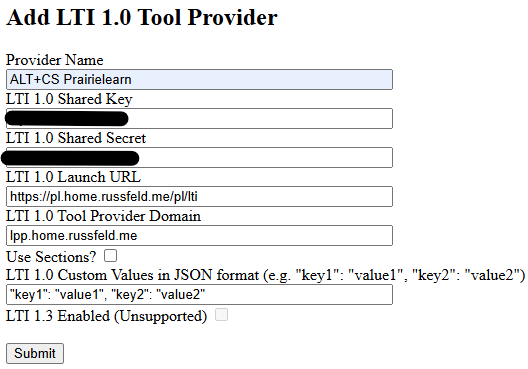
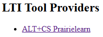
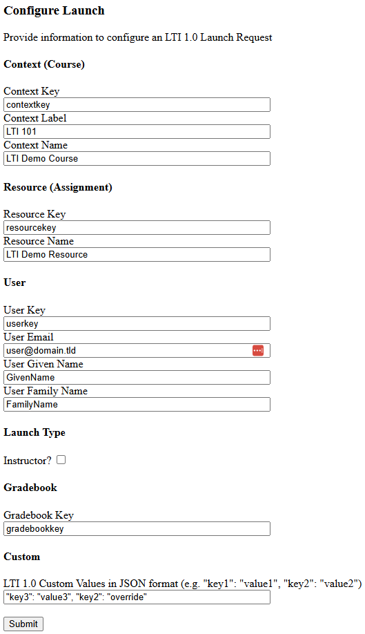
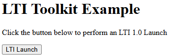
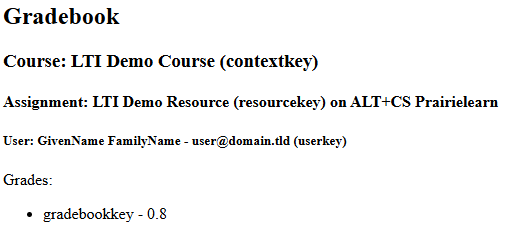

A fully-featured LTI Tool Consumer example can be found in `/examples/consumer`. This document will walk through the details of how that application works.

## Environment

The application expects the following environment variables (typically loaded from `.env`): 

```env {title=".env"}
# Express Session Secret
SESSION_SECRET=your_session_secret

# Log Level
# One of error warn info http verbose lti debug sql silly
LOG_LEVEL=lti

# Application Domain Name
DOMAIN_NAME=https://ltidemo.home.russfeld.me
# Admin Email Address
ADMIN_EMAIL=admin@domain.tld

# LTI Tool Consumer Settings
DEPLOYMENT_NAME=LTI Toolkit Demo
DEPLOYMENT_ID=deployment-001
```

## LTI Toolkit Configuration

The `src/configs/lti.js` file contains a minimal configuration for the LTI Toolkit for use as an LTI Tool Consumer:

```js {title="src/configs/lti.js"}
/**
 * @file Configuration information for LTI Toolkit
 * @author Russell Feldhausen <russfeld@ksu.edu>
 * @exports lti an LTI Toolkit instance configured for this app
 */

// Import LTI Toolkit
import LTIToolkit from "lti-toolkit";

// LTI Grade Handlers (post, read, delete)
import postProviderGrade, { readGradeHandler, deleteGradeHandler } from "../routes/post-grade.js";

// LTI AGS Line Item and Results Handlers
import { getProviderLineItemHandler, getProviderLineItemsHandler, getProviderResultsHandler } from "../routes/get-lineitems.js";

// Initialize LTI Toolkit
const lti = await LTIToolkit({
  // Domain name for this application
  domain_name: process.env.DOMAIN_NAME,
  // Admin email address for this application
  admin_email: process.env.ADMIN_EMAIL,
  // Logging Level
  log_level: process.env.LOG_LEVEL || "silly",
  // Use In-memory database for testing
  db_storage: ":memory:",
  // Consumer Configuration
  consumer: {
    // Grade handlers (LTI 1.0)
    postProviderGrade: postProviderGrade,
    readProviderGrade: readGradeHandler,
    deleteProviderGrade: deleteGradeHandler,
    // AGS handlers (LTI 1.3)
    getProviderLineItem: getProviderLineItemHandler,
    getProviderLineItems: getProviderLineItemsHandler,
    getProviderResults: getProviderResultsHandler,
    // LTI Tool Consumer Information
    deployment_name: process.env.DEPLOYMENT_NAME,
    deployment_id: process.env.DEPLOYMENT_ID,
  },
});

export default lti;
```

It configures an LTI Tool Consumer using the domain provided in the environment. It also configures the log level and tells the system to use an in-memory database instance. In addition, it provides some configuration information about the LTI Tool Consumer using the information provided in the environment. Finally, it directs the library to the handler functions provided by the routes for incoming LTI grade operations (post, read, delete via LTI 1.0) and AGS line item and result read requests (LTI 1.3).

## Integrating Application Routes

The `app.js` file creates a basic [Express](https://www.npmjs.com/package/express) application with a minimal set of libraries and configuration.

```js {title="app.js"}
// Import LTI configuration
import lti from "./configs/lti.js";

// Other imports here

// Create Express application
var app = express();

// Other configuration here

// Add LTI Toolkit Routes
app.use("/lti/consumer", lti.routers.consumer);
```

The details of that file are omitted (_read the source, you must_), but the notable configuration is shown above. The configured LTI Toolkit is imported, and then the LTI Provider Router is connected to the application at the `/lti/consumer` path. So, any incoming requests sent to that URL will be passed to the LTI Toolkit for handling. This matches the default route in the toolkit configuration; if this route is changed, it must also be provided in the configuration.

## Adding an LTI 1.0 Tool Provider

Once the application is launched, the first step is to add an LTI 1.0 Tool Provider from the homepage. Each LTI 1.0 Tool Provider is a little different, so consult the instructions for adding that provider to your LMS. Currently this application only supports manually configured tools (configuration via XML is not currently supported).

Required settings:

* **Provider Name** - a memorable name for the LTI Tool Provider
* **LTI 1.0 Shared Key** - the shared key used with this provider
* **LTI 1.0 Shared Secret** - the shared secret used with this provider
* **LTI 1.0 Launch URL** - the launch URL for the LTI Tool Provider.
* **LTI 1.0 Tool Provider Domain** - the domain for the LTI Tool Provider
* **Use Sections?** - enable if the LTI Tool Provider requires special section configuration
  * Currently this does nothing in the library itself, but may be useful for applications implementing LTI Tool Consumer functionality
* **LTI 1.0 Custom Values** - set custom values for the LTI 1.0 Launch Requests from this Provider
  * These must in a quoted JSON format, e.g. `"key1": "value1", "key2": "value2"`
* **LTI 1.0 Enabled** - enable LTI 1.3 Tool Providers (currently unsupported)

An example configuration for connecting to [PrairieLearn](https://www.prairielearn.com/) is shown below:



LTI 1.0 Tool Providers are added to the system using the `Provider` controller as shown in the `configure` handler.

```js {title="src/routes/configure.js"}
/**
 * Handle LTI Tool Provider Configuration
 *
 * @param {Object} req - the Express request object
 * @param {Object} res - the Express response object
 */
async function ProviderConfigHandler(req, res) {
  let error = null;
  let message = null;

  // Get Form Data
  const data = {
    name: req.body.name,
    // LTI 1.3 is not supported
    lti13: false,
    key: req.body.key,
    secret: req.body.secret,
    launch_url: req.body.launch_url,
    domain: req.body.domain,
    custom: "",
    // use_section is optional
    use_section: req.body.use_section === "true",
  };

  // Handle Custom Parameters
  if (req.body.custom) {
    try {
      // Parse custom parameters as JSON to check format
      const customParams = JSON.parse("{" + req.body.custom + "}");
      // Convert custom parameters to string format for storage
      data.custom = JSON.stringify(customParams);
    } catch (err) {
      error = "Invalid custom parameters: " + err.message;
    }
  }

  if(!error) {
    // Check if any required fields are missing
    const requiredFields = ["name", "key", "secret", "launch_url", "domain"];
    const missingFields = requiredFields.filter((field) => !data[field] || data[field].trim() === "");
    if (missingFields.length > 0) {
      error = "Missing required fields: " + missingFields.join(", ");
    } else {
      // Create Provider
      try {
        await lti.controllers.provider.createProvider(data);
      } catch (err) {
        error = "Failed to create provider: " + err.message;
      }
      if (!error) {
        message = "Successfully created provider.";
      }
    }
  }

  // Get list of configured tool providers
  const providers = await lti.controllers.provider.getAll();

  // Get secrets for each provider and convert to JSON-friendly format
  const providerData = [];
  for (const provider of providers) {
    const providerSecret = await lti.controllers.provider.getSecret(provider.id);
    providerData.push({ ...provider.toJSON(), secret: providerSecret });
  }

  // Render index view
  res.render("index.njk", {
    title: "LTI Tool Consumer - Index",
    domain: process.env.DOMAIN_NAME,
    providers: providerData,
    error,
    message,
  });
}
```

Once an LTI 1.0 Tool Provider is configured, it will be listed on the index page. Click the link to access it.



## Configuring an LTI 1.0 Launch Request

A fully-configured LTI 1.0 Launch Request requires several pieces of information. Generally this information is part of the internal functionalty of the learning management system (LMS) that is implementing LTI 1.0 Tool Consumer functionality. For this example, we instead just use hand-entered values to simulate this process. In an actual LMS, most of this data would already be present.

For all of the items listed below, the **key** values should not be the sequentially autogenerated database IDs, as that may leak internal data from the LMS and allow malicious users to guess other valid values. Intead, these values should be unique and randomly generated, such as [UUIDs](https://en.wikipedia.org/wiki/Universally_unique_identifier) or similar, but they should be consistent (i.e. a key should uniquely identify an item, and that item should always use the same key). Internally, this library uses the [nanoid](https://www.npmjs.com/package/nanoid) package to generate random ID values. 

* **Context** - Generally, the context of an LTI launch refers to a course in the LMS
  * **Key** - a uniquely identifiable key for the course
  * **Label** - a short label for the course (e.g. "LTI 101")
  * **Name** - a long name for the course (e.g. "LTI Demo Course")
* **Resource** - A resource in an LTI launch refers to a specific assignment within the LMS
  * **Key** - a uniquely identifiable key for the assignment
  * **Name** - a long name for the assignment (e.g. "LTI Demo Assignment")
* **User** - Information about the user for the LTI launch. This tool does not currently support anonymous LTI launches.
  * **Key** - a uniquely identifiable key for the user
  * **Email** - the email address associated with the user. Most LTI Tool Providers use the email address to uniquely identify users within their own systems. 
  * **Given Name** - the given name, sometimes referred to as the first name, of the user
  * **Family Name** - the family name, sometimes referred to as the last name or surname, of the user
* **Launch Type** - currently this tool only supports launching as either an "Instructor" or "Learner" role
* **Gradebook Key** - a uniquely identifiable key for the gradebook line item. This can be used to differentiate between individual launches to the same LTI Tool Provider, or to differentiate between launches to different LTI Tool Providers using the same context and resource keys.
* **Custom** - a quoted JSON list of custom parameters to include with the launch (e.g. `"key1": "value1", "key2": "value2"`). These will be added to the parameters configured in the Provider. If two custom parameters have the same key, then the parameters from the launch will override those from the Provider. 

This sample application provides default values for all of these options in the form to configure the launch. 



Once the launch is configured, click the "Submit" button to prepare the LTI 1.0 Launch page. This is handled by the `provider-launch` handler in the demo application. In short, it collects all of the form data and constructs the parameters for the `generateLTI10LaunchFormData` function in the LTI Consumer controller:

```js {title="src/routes/provider-launch.js"}
/**
 * Provider Launch Handler for LTI Tool Consumer
 *
 * @param {Object} req - the Express request object
 * @param {Object} res - the Express response object
 */
async function ProviderLaunchHandler(req, res) {
  let error = null;
  let message = null;

  const providerId = req.params.id;

  // Get Provider
  const provider = await lti.controllers.provider.getById(providerId);
  if (!provider) {
    return res.status(404).send("Provider not found");
  }

  // Get Secret
  const providerSecret = await lti.controllers.provider.getSecret(provider.id);

  // Formatted provider including secret
  const providerData = provider.toJSON();
  providerData.secret = providerSecret.secret;

  // Get Form Data
  const data = {
    context: {
      key: req.body.context_key,
      label: req.body.context_label,
      name: req.body.context_name,
    },
    resource: {
      key: req.body.resource_key,
      name: req.body.resource_name,
    },
    user: {
      key: req.body.user_key,
      email: req.body.user_email,
      given_name: req.body.user_given_name,
      family_name: req.body.user_family_name,
      name: req.body.user_given_name + " " + req.body.user_family_name,
    },
    manager: req.body.manager === "true",
    gradebook_id: req.body.gradebook_id,
    custom: {}
  };

  // Handle custom parameters
  if(req.body.custom) {
    try {
      const customParams = JSON.parse("{" + req.body.custom + "}");
      data.custom = customParams;
    } catch (err) {
      error = "Invalid custom parameters: " + err.message;

      // Render provider view
      res.render("provider.njk", {
        title: `LTI Tool Consumer - Provider: ${provider.name}`,
        provider: providerData,
        error: error,
        message: message,
      });
      return
    }
  }

  if(provider.custom) {
    try {
      const providerCustom = JSON.parse(provider.custom);
      // merge provider custom parameters with launch custom parameters, giving precedence to launch parameters
      data.custom = { ...providerCustom, ...data.custom };
    } catch (err) {
      error = "Invalid provider custom parameters: " + err.message;

      // Render provider view
      res.render("provider.njk", {
        title: `LTI Tool Consumer - Provider: ${provider.name}`,
        provider: providerData,
        error: error,
        message: message,
      });
      return
    }
  }

  // Check if any required fields are missing
  const requiredFields = [
    "context.key",
    "context.label",
    "context.name",
    "resource.key",
    "resource.name",
    "user.key",
    "user.email",
    "user.given_name",
    "user.family_name",
    "manager",
    "gradebook_id",
  ];
  const missingFields = requiredFields.filter((field) => {
    // Handle nested fields
    const fieldParts = field.split(".");
    let value = data;
    for (const part of fieldParts) {
      value = value[part];
      if (value === undefined) {
        return true;
      }
    }
    return value === undefined || value === null || value.toString().trim() === "";
  });
  if (missingFields.length > 0) {
    error = "Missing required fields: " + missingFields.join(", ");

    // Render provider view
    res.render("provider.njk", {
      title: `LTI Tool Consumer - Provider: ${provider.name}`,
      provider: providerData,
      error: error,
      message: message,
    });
  } else {
    // Store launch data in local data store
    updateDataStoreWithLaunch(data, providerData, req);

    // Create LTI Launch
    const launch = lti.controllers.lti.consumer.generateLTI10LaunchFormData(
      providerData.key,
      providerData.secret,
      providerData.launch_url,
      "/provider/" + providerData.id,
      data.context,
      data.resource,
      data.user,
      data.manager,
      data.gradebook_id,
      data.custom,
    );

    // Render template
    res.render("launch.njk", {
      launch,
    });
  }
}
```

The `generateLTI10LaunchFormData` function returns an object with 2 attributes:
* `action` : the LTI Launch URL to send the request to
* `fields` : a set of fields to be sent in the LTI Launch

## Sending an LTI Launch Request

LTI 1.0 Launch Requests must be sent by the user's browser. The easiest way to do this is by constructing a form on the webpage with only hidden fields, and then having the user click a button to submit the form to the LTI Launch URL of the LTI 1.0 Tool Provider. The form can also be configured to submit automatically if desired. 

The `launch.njk` template demonstrates how to generate this page using the [Nunjucks](https://www.npmjs.com/package/nunjucks) template engine. 

```njk {title="src/views/launch.njk"}
<form method="POST" action="{{ launch.action }}">
  
  <input type="hidden" id="{{ attr }}" name="{{ attr }}" value="{{ value }}" />
  
  <input type="submit" value="LTI Launch">
</form>
```

Below is another helpful example for creating a similar page using a [Vue.js](https://vuejs.org/) component:

```vue
<template>
  <div id="auto-form">
    <form v-if="form" :action="form.action" method="POST">
      <input
        v-for="(value, key) in form.fields"
        :key="key"
        :name="key"
        :value="value"
        type="hidden"
      />
      <Button type="submit" label="Launch Lesson" severity="primary" />
    </form>
  </div>
</template>
```

Using the settings configured above, an LTI Launch page would contain the following object:

```json 
{
  "fields": {
    "oauth_consumer_key": <redacted>,
    "oauth_signature_method": "HMAC-SHA1",
    "oauth_timestamp": "1772312184",
    "oauth_nonce": "R3_jO02t8_eBZz1EzpwXW",
    "oauth_version": "1.0",
    "context_id": "contextkey",
    "context_label": "LTI 101",
    "context_title": "LTI Demo Course",
    "launch_presentation_document_target": "iframe",
    "launch_presentation_locale": "en",
    "launch_presentation_return_url": "/provider/1",
    "lis_outcome_service_url": "https://ltidemo.home.russfeld.me/lti/consumer/grade",
    "lis_result_sourcedid": "contextkey:resourcekey:userkey:gradebookkey",
    "lis_person_contact_email_primary": "user@domain.tld",
    "lis_person_name_family": "FamilyName",
    "lis_person_name_full": "GivenName FamilyName",
    "lis_person_name_given": "GivenName",
    "lti_message_type": "basic-lti-launch-request",
    "lti_version": "LTI-1p0",
    "oauth_callback": "about:blank",
    "resource_link_id": "resourcekey",
    "resource_link_title": "LTI Demo Resource",
    "roles": "Learner",
    "tool_consumer_info_product_family_code": "lti-toolkit",
    "tool_consumer_info_version": "cloud",
    "tool_consumer_instance_contact_email": "admin@domain.tld",
    "tool_consumer_instance_guid": "deployment-001",
    "tool_consumer_instance_name": "LTI Toolkit Demo",
    "user_id": "userkey",
    "custom_key1": "value1",
    "custom_key2": "override",
    "custom_key3": "value3",
    "oauth_signature": <redacted>
  },
  "action": "https://pl.home.russfeld.me/pl/lti"
}
```

The resulting page:



Click the button to launch the LTI 1.0 Tool Provider.

## Handling Basic Outcomes Grade Passback

At any time, the LTI 1.0 Tool Provider may provide updated grade information to our example program. That is received at the `grade` route in the LTI Consumer Router, and then sent to the `postProviderGrade` function provided in the toolkit configuration as shown above. For this example program, this is handled in the `post-grade` handler:

```js {title="src/routes/post-grade.js"}
/**
 * LTI Grade Passback Handler for LTI Tool Consumer
 *
 * @param {string} providerKey the provider key
 * @param {string} contextKey the context (course) key
 * @param {string} resourceKey the resource (lesson or assignment) key
 * @param {string} gradebookKey the gradebook key
 * @param {Object} gradeScore the AGS-style grade score object
 * @param {string} gradeScore.userId the user ID
 * @param {number} gradeScore.scoreGiven the score given (0.0 - 1.0)
 * @param {number} gradeScore.scoreMaximum the maximum score
 * @param {string} gradeScore.activityProgress the activity progress status
 * @param {string} gradeScore.gradingProgress the grading progress status
 * @param {string} gradeScore.timestamp the ISO 8601 timestamp of the grade
 * @param {Object} req the Express request object
 */
async function postGradeHandler(providerKey, contextKey, resourceKey, gradebookKey, gradeScore, req) {
  // Store grade in the local data store
  updateLocalDataStoreWithGrade(req, contextKey, resourceKey, gradebookKey, gradeScore);

  // Return success response
  return {
    success: true,
    message: "Grade posted successfully",
  };
}
```

This function is called with a number of helpful parameters:

* `providerKey` - the shared key for the LTI Tool Provider, which can be used to look up the provider in the `Provider` controller with the `getByKey` method.
* `contextKey` - the unique key for the context (course) in the original LTI launch
* `resourceKey` - the unique key for the resource (assignment) in the original LTI launch
* `gradebookKey` - the unique key for the gradebook line item in the original LTI launch
* `gradeScore` - an AGS-style grade score object containing:
  * `userId` - the unique key for the user in the original LTI launch
  * `scoreGiven` - the grade received, as a floating-point value
  * `scoreMaximum` - the maximum possible score (typically `1.0`)
  * `activityProgress` - the student's activity progress (e.g. `"Submitted"`, `"Completed"`)
  * `gradingProgress` - the grading status (e.g. `"FullyGraded"`, `"Pending"`)
  * `timestamp` - an ISO 8601 timestamp of when the grade was submitted
* `req` - the original Express request object

Both LTI 1.0 and LTI 1.3 grade passbacks are delivered through this same callback. For LTI 1.0 Basic Outcomes, the library maps the incoming score to this same AGS-style object (using fixed values of `"Submitted"` and `"FullyGraded"` for the progress fields) so the consuming application can handle both protocols uniformly. This should be enough information to properly record the grade in the LMS gradebook. In this example application, it is just stored in an in-memory object for short-term tracking.

## Viewing Grades

This example application will display any grades received and stored in local memory in the `grades` path:



This matches the grade found in the LTI 1.0 Tool Provider:


## Handling AGS Line Item Requests (LTI 1.3)

When this application acts as an LTI 1.3 Tool Consumer (LMS), connected LTI 1.3 Tool Providers may request line item metadata using the AGS (Assignment and Grade Services) read endpoints. This allows a Tool Provider to discover the label and maximum score for a gradebook entry without requiring the LMS to push that data during launch.

The toolkit exposes two callbacks for this purpose, both implemented in `src/routes/get-lineitems.js`:

```js {title="src/routes/get-lineitems.js"}
/**
 * Handler for LTI 1.3 AGS GET line item requests.
 * Returns metadata for a single gradebook line item identified by context, resource, and gradebook key.
 *
 * @param {string} providerKey the provider key (from the AGS token)
 * @param {string} contextKey the context (course) key
 * @param {string} resourceKey the resource (assignment) key
 * @param {string} gradebookKey the gradebook key
 * @param {Object} req the Express request object
 * @returns {{ label: string, scoreMaximum: number }|null} line item metadata, or null if not found
 */
async function getProviderLineItemHandler(providerKey, contextKey, resourceKey, gradebookKey, req) {
  const courses = req.app.locals.dataStore.courses;
  const assignment = courses[contextKey]?.assignments[resourceKey];

  if (!assignment) {
    return null;
  }

  // Find a scoreMaximum from any stored grade for this gradebook key, defaulting to 1.0
  let scoreMaximum = 1.0;
  for (const user of Object.values(assignment.users)) {
    const grade = user.grades[gradebookKey];
    if (grade && grade.scoreMaximum !== undefined && grade.scoreMaximum !== null) {
      scoreMaximum = grade.scoreMaximum;
      break;
    }
  }

  return {
    label: assignment.name,
    scoreMaximum,
  };
}

/**
 * Handler for LTI 1.3 AGS GET line items requests.
 * Returns all line items for a context, optionally filtered by resource link ID.
 * Each unique (resourceKey, gradebookKey) pair is returned as a separate line item.
 *
 * @param {string} providerKey the provider key (from the AGS token)
 * @param {string} contextKey the context (course) key
 * @param {string|null} resource_link_id optional resource link ID to filter results
 * @param {Object} req the Express request object
 * @returns {Array<{ resourceKey: string, gradebookKey: string, label: string, scoreMaximum: number }>|null}
 */
async function getProviderLineItemsHandler(providerKey, contextKey, resource_link_id, req) {
  const courses = req.app.locals.dataStore.courses;
  const course = courses[contextKey];

  if (!course) {
    return null;
  }

  const lineItems = [];

  for (const [resourceKey, assignment] of Object.entries(course.assignments)) {
    if (resource_link_id && resourceKey !== resource_link_id) {
      continue;
    }

    // Collect unique gradebook keys and their scoreMaximums across all users
    const gradebookKeys = new Map();
    for (const user of Object.values(assignment.users)) {
      for (const [gKey, grade] of Object.entries(user.grades)) {
        if (!gradebookKeys.has(gKey)) {
          const scoreMaximum =
            grade && grade.scoreMaximum !== undefined && grade.scoreMaximum !== null ? grade.scoreMaximum : 1.0;
          gradebookKeys.set(gKey, scoreMaximum);
        }
      }
    }

    for (const [gradebookKey, scoreMaximum] of gradebookKeys) {
      lineItems.push({
        resourceKey,
        gradebookKey,
        label: assignment.name,
        scoreMaximum,
      });
    }
  }

  return lineItems;
}
```

The callbacks receive the following parameters:

**`getProviderLineItem`** — called when a Tool Provider requests a single line item:
* `providerKey` - the key of the requesting provider, usable with `getByKey` on the provider controller
* `contextKey` - the context (course) key from the original LTI launch
* `resourceKey` - the resource (assignment) key from the original LTI launch
* `gradebookKey` - the gradebook key from the original LTI launch
* `req` - the Express request object

Return `{ label, scoreMaximum }` if the line item is found, or `null` to send a 404 response.

**`getProviderLineItems`** — called when a Tool Provider requests all line items for a context:
* `providerKey` - the key of the requesting provider
* `contextKey` - the context (course) key
* `resource_link_id` - an optional filter; if provided, return only line items matching this resource key
* `req` - the Express request object

Return an array of `{ resourceKey, gradebookKey, label, scoreMaximum }` objects — one per unique `(resourceKey, gradebookKey)` pair. The `gradebookKey` differentiates multiple line items for the same resource (for example, when students may repeat or re-attempt an assignment). Return `null` if the context is not found; return `[]` if the context exists but has no matching line items.

The toolkit uses these return values to build the spec-compliant AGS response objects, including constructing the `id` URL for each line item automatically.

## Handling AGS Result Requests (LTI 1.3)

When a Tool Provider requests the current result status for a line item, the toolkit calls the `getProviderResults` callback. This endpoint (`GET /lti/consumer/ags/:context_key/:resource_key/:gradebook_key/results`) requires the `result.readonly` AGS scope. Results represent the grade a specific user received for a specific line item.

```js {title="src/routes/get-lineitems.js"}
/**
 * Handler for LTI 1.3 AGS GET results requests.
 * Returns the current result status for each user who has submitted a grade for a given line item.
 *
 * @param {string} providerKey the provider key (from the AGS token)
 * @param {string} contextKey the context (course) key
 * @param {string} resourceKey the resource (assignment) key
 * @param {string} gradebookKey the gradebook key
 * @param {string|null} userId optional user ID to filter results to a single user
 * @param {Object} req the Express request object
 * @returns {Array<{ userId: string, resultScore: number, resultMaximum: number, comment: null }>|null}
 *   array of result objects, or null if assignment not found
 */
async function getProviderResultsHandler(providerKey, contextKey, resourceKey, gradebookKey, userId, req) {
  const courses = req.app.locals.dataStore.courses;
  const assignment = courses[contextKey]?.assignments[resourceKey];

  if (!assignment) {
    return null;
  }

  const results = [];
  for (const [userKey, user] of Object.entries(assignment.users)) {
    if (userId && userKey !== userId) {
      continue;
    }
    const grade = user.grades[gradebookKey];
    if (grade && grade.scoreGiven !== null && grade.scoreGiven !== undefined) {
      results.push({
        userId: userKey,
        resultScore: grade.scoreGiven,
        resultMaximum: grade.scoreMaximum,
        comment: null,
      });
    }
  }
  return results;
}
```

**`getProviderResults`** — called when a Tool Provider requests result status for a line item:
* `providerKey` - the key of the requesting provider
* `contextKey` - the context (course) key
* `resourceKey` - the resource (assignment) key
* `gradebookKey` - the gradebook key
* `userId` - an optional filter; if provided, return only results for this user ID
* `req` - the Express request object

Return an array of `{ userId, resultScore, resultMaximum, comment }` objects — one per user who has submitted a grade for this line item. The `resultScore` is the raw score given (not normalized) and `resultMaximum` is the maximum possible score. Return `null` if the assignment is not found; return `[]` if no users have submitted grades yet.

The toolkit wraps each result with the spec-compliant `id` and `scoreOf` URLs automatically.

## Handling LTI 1.0 Read and Delete Grade Requests

When this application acts as an LTI 1.0 Tool Consumer, connected LTI 1.0 Tool Providers may also send `readResultRequest` and `deleteResultRequest` in addition to the standard `replaceResultRequest`. These allow a Tool Provider to check or clear a previously submitted grade.

The toolkit calls the optional `readProviderGrade` and `deleteProviderGrade` callbacks, both implemented in `src/routes/post-grade.js`:

```js {title="src/routes/post-grade.js"}
async function readGradeHandler(providerKey, contextKey, resourceKey, userKey, gradebookKey, req) {
  const courses = req.app.locals.dataStore.courses;
  const grade = courses[contextKey]?.assignments[resourceKey]?.users[userKey]?.grades[gradebookKey];
  if (!grade || grade.scoreGiven === null || grade.scoreGiven === undefined) {
    return null;
  }
  const score = grade.scoreMaximum > 0 ? grade.scoreGiven / grade.scoreMaximum : 0;
  return { score };
}

async function deleteGradeHandler(providerKey, contextKey, resourceKey, userKey, gradebookKey, req) {
  const courses = req.app.locals.dataStore.courses;
  const user = courses[contextKey]?.assignments[resourceKey]?.users[userKey];
  if (!user || !user.grades[gradebookKey]) {
    return { success: true, message: "No grade to delete" };
  }
  delete user.grades[gradebookKey];
  return { success: true, message: "Grade deleted successfully" };
}
```

**`readProviderGrade`** — called when a Tool Provider sends a `readResultRequest`:
* `providerKey` - the provider key object with `key` and `secret`
* `contextKey`, `resourceKey`, `userKey`, `gradebookKey` - parsed from the LTI 1.0 sourcedId
* `req` - the Express request object

Return `{ score: number }` (a value between 0.0 and 1.0) if a grade exists, or `null` if no grade is on file. The toolkit sends the score back to the provider in the LTI 1.0 XML response.

**`deleteProviderGrade`** — called when a Tool Provider sends a `deleteResultRequest`:
* Same parameters as `readProviderGrade`

Return `{ success: boolean, message: string }`. If `success` is false, the toolkit returns a failure response to the provider.

If either callback is not configured, the toolkit returns an `unsupported` response to the Tool Provider.
