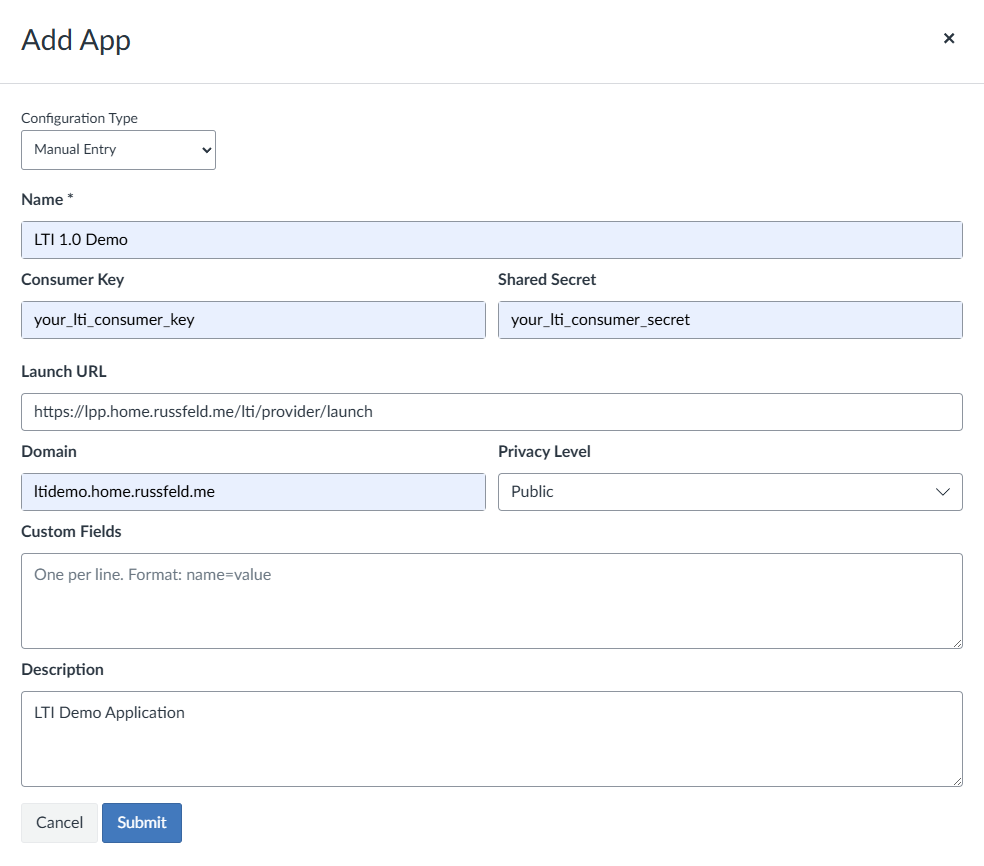
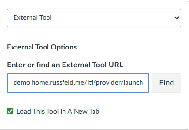
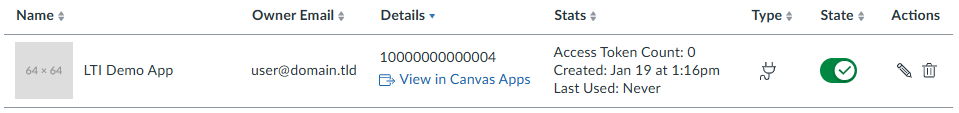
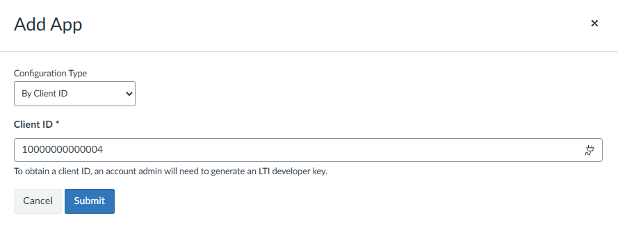
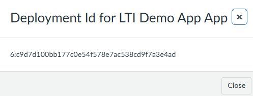

A fully-featured LTI Tool Provider example can be found in `/examples/provider`. This document will walk through the details of how that application works.

## Environment

The application expects the following environment variables (typically loaded from `.env`): 

```env {title=".env"}
# Express Session Secret
SESSION_SECRET=your_session_secret

# Log Level
# One of error warn info http verbose lti debug sql silly
LOG_LEVEL=lti

# Application Domain Name
DOMAIN_NAME=https://ltidemo.home.russfeld.me
# Admin Email Address
ADMIN_EMAIL=admin@domain.tld

# LTI Consumer Key and Secret
LTI_CONSUMER_KEY=your_lti_consumer_key
LTI_CONSUMER_SECRET=your_lti_consumer_secret

# LTI 1.3 LMS Domain
LTI_13_LMS_DOMAIN=https://canvas.instructure.com
```

## LMS Configuration - LTI 1.0

The settings above can then be used to configure this application in your learning management system (LMS) using LTI 1.0. Refer to your LMS documentation for specific details. An example using Canvas is given below.

* **Consumer Key** - `LTI_CONSUMER_KEY` from the app environment.
* **Shared Secret** - `LTI_CONSUMER_SECRET` from the app environment.
* **XML Configuration URL** - `DOMAIN_NAME` from the app environment followed by `/lti/provider/config10` by default. The URL can be configured in `app.js` as described below.
  * Additional settings for the XML configuration can be set in the `lti.js` config file.
* **Launch URL** - `DOMAIN_NAME` from the app environment followed by `/lti/provider/launch10` by default. The URL can be configured in `app.js` as described below.
* **Domain** - typically the `DOMAIN_NAME` from the app environment without the `https://` at the front.
* **Privacy Level** - any option ("Public" provides all info, "Anonymous" omits most student info).

### XML Configuration


### Manual Configuration



Once the application has been added to the course, an assignment can be created to direct students to the Launch URL used above.



To access the rest of the application, students and teachers should use the assignment configured in the learning management system to perform an LTI Launch as described below.

## LTI Toolkit Configuration

The `src/configs/lti.js` file contains a minimal configuration for the LTI Toolkit for use as an LTI 1.0 Tool Provider:

```js {title="src/configs/lti.js"}
/**
 * @file Configuration information for LTI Toolkit
 * @author Russell Feldhausen <russfeld@ksu.edu>
 * @exports lti an LTI Toolkit instance configured for this app
 */

// Import LTI Toolkit
import LTIToolkit from "lti-toolkit";

// LTI Launch Handler
import LTILaunch from "../routes/lti-launch.js";

// Initialize LTI Toolkit
const lti = await LTIToolkit({
  // Domain name for this application
  domain_name: process.env.DOMAIN_NAME,
  // Admin email address for this application
  admin_email: process.env.ADMIN_EMAIL,
  // Logging Level
  log_level: process.env.LOG_LEVEL || "silly",
  // Use In-memory database for testing
  db_storage: ":memory:",
  provider: {
    // Incoming LTI Launch Handler
    handleLaunch: LTILaunch,
    // LTI 1.0 Consumer Key and Shared Secret
    // for single LTI consumer setup
    key: process.env.LTI_CONSUMER_KEY,
    secret: process.env.LTI_CONSUMER_SECRET,
  },
});

export default lti;
```

It configures a default LTI 1.0 Tool Provider using the domain, key and secret provided in the environment. It also configures the log level and tells the system to use an in-memory database instance. Finally, it directs the library to the `LTILaunch` function provided by one of the routes as the handler for incoming LTI Launch Requests.

## Integrating Application Routes

The `app.js` file creates a basic [Express](https://www.npmjs.com/package/express) application with a minimal set of libraries and configuration.

```js {title="app.js"}
// Import LTI configuration
import lti from "./configs/lti.js";

// Other imports here

// Create Express application
var app = express();

// Other configuration here

// Add LTI Toolkit Routes
app.use("/lti/provider", lti.routers.provider);
```

The details of that file are omitted (_read the source, you must_), but the notable configuration is shown above. The configured LTI Toolkit is imported, and then the LTI Provider Router is connected to the application at the `/lti/provider` path. So, any incoming requests sent to that URL will be passed to the LTI Toolkit for handling. This matches the route used when configuring the tool in Canvas as shown above.

## LTI Launch Handler

The LTI Launch Handler function will receive three parameters:

* `launchData` - an instance of the [LTI Launch Data]({})
* `consumer` - a Sequelize instance of an [LTI Consumer]({}) from the database
* `req` - the incoming Express request object

In the example project, we use the following LTI Launch Handler:

```js {title="src/routes/lti-launch.js"}
/**
 * Handle an incoming LTI Launch Request
 *
 * @param {Object} launchData - an LTI Launch Data object
 * @param {Object} consumer - the LTI consumer object
 * @param {Object} req - the Express request object
 * @returns {String} a URL to redirect the user to after launch
 */
async function LTILaunch(launchData, consumer, req) {
  // We will store the LTI Launch Data and Consumer in the session for later use
  req.session.ltiLaunchData = launchData;
  req.session.ltiConsumer = consumer.toJSON();

  // Determine if the user is a teacher or student
  const isStudent = parseRoles(launchData);

  // Record data in local data store
  updateDataStore(launchData, isStudent, req);

  // Redirect user based on role
  if (isStudent) {
    return "/student";
  } else {
    return "/instructor";
  }
}
```

Notice that we serialize the `consumer` parameter to JSON since it is provided as a Sequelize object instance. 

This handler users two helper functions. The first will parse the incoming roles in the `launchData` object:

```js {title="src/routes/lti-launch.js"}
/**
 * Parse LTI roles to determine user type
 * @param {Object} launchData - the LTI Launch Data object
 * @returns {Boolean} 'true' if user is a student, 'false' otherwise
 */
function parseRoles(launchData) {
  try {
    if (launchData.launch_type === "lti1.0") {
      // See https://www.imsglobal.org/specs/ltiv1p0/implementation-guide#toc-9
      // LTI 1.0 roles are a long string
      if (launchData.user_roles.includes("Learner")) {
        return true;
      }
      return false;
    } else if (launchData.launch_type === "lti1.3") {
      // See https://www.imsglobal.org/spec/lti/v1p3#role-vocabularies
      // LTI 1.3 roles are an array of strings
      if (launchData.user_roles.some((role) => role.includes("Learner"))) {
        return true;
      }
      return false;
    } else {
      // Unknown LTI version
      console.error("Unknown LTI launch type:", launchData.launch_type);
      return false;
    }
  } catch (error) {
    console.error("Error parsing roles:", error);
    console.error("Roles data:", launchData.user_roles);
    return false;
  }
}
```

It will simply return `true` if the role is a student, otherwise it will treat the role as an instructor. This may or may not be desired behavior for a production application.

Finally, it also stores data about the incoming `launchData` in a shared data structure that is only stored in memory.

```js {title="src/routes/lti-launch.js"} 
/**
 * Update local data store
 * 
 * @param {Object} launchData - the LTI Launch Data object
 * @param {Boolean} isStudent - 'true' if user is a student, 'false' otherwise
 * @param {Object} req - the Express request object
 */
function updateDataStore(launchData, isStudent, req) {
  // This is a placeholder function for updating a local data store
  // In a real application, you would implement logic to store
  // relevant launch data in your database or other storage system
  const courses = req.app.locals.dataStore.courses;
  const courseId = launchData.course_id;
  if (!courses[courseId]) {
    courses[courseId] = {
      name: launchData.course_name,
      label: launchData.course_label,
      assignments: {},
    };
  }
  const assignments = courses[courseId].assignments;
  const assignmentId = launchData.assignment_id;
  if (!assignments[assignmentId]) {
    assignments[assignmentId] = {
      name: launchData.assignment_name,
      lti_id: launchData.assignment_lti_id,
      grade_url: launchData.outcome_url,
      grades: {},
    };
  }
  if (isStudent) {
    const userName = launchData.user_name;
    const userId = launchData.user_lis_id;
    const userId13 = launchData.user_lis13_id;
    const outcomeId = launchData.outcome_id;
    assignments[assignmentId].grades[userId] = {
      name: userName,
      lis_id: userId,
      lis13_id: userId13,
      outcome_id: outcomeId,
      score: null,
    };
  }
}
```

In practice, this would be replaced with appropriate code and logic to store this data in a database or other storage mechanism for the application. However, this data structure is instructive as it shows a minimal set of data that could be stored in order to track courses, assignments, students, and grades. 

## Student Grade Passback

Once a student's grade has been determined, it can be passed back to the learning management system (LMS) using the LTI Controller's `postGrade` method:

```js {title="src/routes/student-grade.js"}
/**
 * Handle LTI Student Grade Postback
 *
 * @param {Object} req - the Express request object
 * @param {Object} res - the Express response object
 */
async function StudentGradeHandler(req, res) {
  // Get LTI Launch Data and Consumer from session
  const launchData = req.session.ltiLaunchData;
  const consumer = req.session.ltiConsumer;

  let error = null;
  let message = null;

  // Get grade from form submission
  const grade = parseFloat(req.body.grade);
  if (isNaN(grade) || grade < 0 || grade > 1) {
    error = "Invalid grade value. Must be between 0 and 1.";
  } else {
    // Post grade back to the LTI Provider
    // Build Grade Object
    const gradeObject = {
      // LTI Consumer ID
      consumer_id: consumer.id,
      // LTI 1.0 Outcome Information
      grade_url: launchData.outcome_url,
      lms_grade_id: launchData.outcome_id,
      // Grade value between 0.0 and 1.0
      score: grade,
      // LTI 1.3 User ID
      user_lis13_id: launchData.user_lis13_id,
      // Helpful Debugging Information
      debug: {
        // User Name
        user: launchData.user_name,
        // User ID (LTI 1.0 and LTI 1.3)
        user_id: launchData.user_lis_id + " (" + launchData.user_lis13_id + ")",
        // Assignment Name
        assignment: launchData.assignment_name,
        // Assignment ID (LTI 1.0 and LTI 1.3)
        assignment_id:
          launchData.assignment_id + "(" + launchData.assignment_lti_id + ")",
      },
    };
    if (lti.controllers.lti.postGrade(gradeObject)) {
      message = `Successfully posted grade of ${grade} back to the LMS.`;
      // Record grade in local data store
      updateDataStoreWithGrade(launchData, grade, req);
    } else {
      error = "Failed to post grade back to the LMS.";
    }
  }

  // Render student view with LTI Launch Data
  res.render("student.njk", {
    title: "LTI Tool Provider - Student View",
    message: message,
    error: error,
    launchData: launchData,
    consumer: consumer,
  });
}
```

This method constructs the grade object required by the `postGrade` method using data from the LTI Launch Data and the LTI Consumer originally provided to the LTI Launch Handler. In this example, those values are read directly from the user's session. 

## Instructor Grade Passback

A more advanced example of submitting grades could involve the instructor providing grades after a student has completed an assignment:

```js {title="src/routes/instructor-grade.js"}
/**
 * Handle LTI Instructor Grade Postback
 *
 * @param {Object} req - the Express request object
 * @param {Object} res - the Express response object
 */
async function InstructorGradeHandler(req, res) {
  // Get LTI Launch Data and Consumer from session
  const launchData = req.session.ltiLaunchData;
  const consumer = req.session.ltiConsumer;

  let error = null;
  let message = null;

  // Get form data
  const courseId = req.body.course;
  const assignmentId = req.body.assignment;
  const userId = req.body.user;
  const grade = parseFloat(req.body.grade);

  // Get assignment and user info from local data store
  // This is a placeholder function for updating a local data store
  // In a real application, you would implement logic to store
  // relevant grade data in your database or other storage system
  const courses = req.app.locals.dataStore.courses;
  const assignments = courses[courseId].assignments;

  if (isNaN(grade) || grade < 0 || grade > 1) {
    error = "Invalid grade value. Must be between 0 and 1.";
  } else {
    // Post grade back to the LTI Provider
    // Build Grade Object
    const gradeObject = {
      // LTI Consumer ID
      consumer_id: consumer.id,
      // LTI 1.0 Outcome Information
      grade_url: assignments[assignmentId].grade_url,
      lms_grade_id: assignments[assignmentId].grades[userId].outcome_id,
      // Grade value between 0.0 and 1.0
      score: grade,
      // LTI 1.3 User ID
      user_lis13_id: assignments[assignmentId].grades[userId].lis13_id,
      // Helpful Debugging Information
      debug: {
        // User Name
        user: assignments[assignmentId].grades[userId].name,
        // User ID (LTI 1.0 and LTI 1.3)
        user_id:
          assignments[assignmentId].grades[userId].lis_id +
          " (" +
          assignments[assignmentId].grades[userId].lis13_id +
          ")",
        // Assignment Name
        assignment: assignments[assignmentId].name,
        // Assignment ID (LTI 1.0 and LTI 1.3)
        assignment_id:
          assignmentId + "(" + assignments[assignmentId].lti_id + ")",
      },
    };
    if (lti.controllers.lti.postGrade(gradeObject)) {
      message = `Successfully posted grade of ${grade} back to the LMS.`;

      // Record grade in local data store
      assignments[assignmentId].grades[userId].score = grade;
    } else {
      error = "Failed to post grade back to the LMS.";
    }
  }

  // Render instructor view with LTI Launch Data
  res.render("instructor.njk", {
    title: "LTI Tool Provider - Instructor View",
    message: message,
    error: error,
    courses: req.app.locals.dataStore.courses,
    launchData: launchData,
    consumer: consumer,
  });
}
```

In this example, the same data required to build a grade object is read from the shared data structure stored in memory. Again, in practice, this data would be read from a database or another storage mechanism, but this code should be instructive.

## LTI 1.3 Configuration

Configuring an application to use the LTI 1.3 protocol is a bit more complex, and requires several steps in both the learning management system (LMS) as well as this tool. Detailed instructions and configuration information can be found at the `/admin` route in the example application, and also are discussed below.

### Step 1 - Add an LTI 1.3 Application in the LMS

The first step is to add an LTI 1.3 application to the learning management system. In Canvas, this requires administrator access, so you may have to work with your Canvas administrator to accomplish this step. In Canvas, go to the Admin panel for the account used and find the Developer Keys page, then add a new LTI Key.

* **Redirect URIs**: `DOMAIN_NAME` from the app environment followed by `/lti/provider/redirect13` by default.
* **Target Link URIs**: `DOMAIN_NAME` from the app environment followed by `/lti/provider/launch13` by default.
* **OpenID Connect Initiation Url**: `DOMAIN_NAME` from the app environment followed by `/lti/provider/login13/` and then the `LTI_CONSUMER_KEY` from the app environment by default.
* **JWK Method**: Public JWK URL (this library only supports JWKS via URL)
* **Public JWK URL**: `DOMAIN_NAME` from the app environment followed by `/lti/provider/key13` by default.

The base of these URLs can be configured in `app.js` as discussed above. 


In the LTI Advantage Services configuration, at a minimum the "Can create and update submission results for assignments associated with the tool" must be selected, which will allow this application to send grades back to the learning management system.


At the bottom, the privacy level may be set to any value. The "Public" option provides all data about students (name, email, image). Other privacy levels may omit some of this data.


Once the LTI Key is created, a Client ID is provided by Canvas. Make a note of this value for later. Also, make sure the LTI Key is enabled here.



### Step 2 - Add LTI 1.3 Application to a Course

Once the LTI 1.3 Key is created, the application can be added to a course within the learning management system. In Canvas, this can be found on the Settings of a course on the Apps tab. Click the button to add a new application, and enter the Client ID from Step 1 above.



Once the application has been added to the course, click the menu next to the application and display the Deployment ID for the application. Save this value for later. 



### Step 3 - Configure LTI 1.3 Settings

Back in the LTI Provider Demo application, click the link on the homepage or navigate to the `/admin` page to access the LTI 1.3 configuration. On this page, enter the LTI 1.3 configuration information for your learning management system. Examples below are shown for Canvas using the configuration provided in the steps above.

* **LTI 1.3 Client ID:** From Step 1 Above
* **LTI 1.3 Platform ID:** This is usually just the URL of the LMS
* **LTI 1.3 Deployment ID:** From Step 2 Above
* **LTI 1.3 JWKS Keyset URL:** For Canvas, `/api/lti/security/jwks`
* **LTI 1.3 Token URL:** For Canvas, `/login/oauth2/token`
* **LTI 1.3 Auth URL:** For Canvas, `/api/lti/authorize_redirect`


### Step 4 - Configure LMS Assignment

In Canvas, configure an assignment that uses an external URL (similar to working with LTI 1.0 Applications as shown below). This time, it will use the Target Link URI configured in Step 1 - typically the `DOMAIN_NAME` from the environment followed by `/lti/provider/launch13`.


From this point onward, students and teachers can access the LTI Demo Application through this Canvas assignment to perform an LTI 1.3 Launch.

## Managing LTI Consumers

Within the sample application, the Admin Configuration handler gives a demonstration for using this library's controllers to manage the LTI Consumers available within the application.

```js {title="src/routes/admin-config.js"}
/**
 * Handle LTI Admin Launch
 *
 * @param {Object} req - the Express request object
 * @param {Object} res - the Express response object
 */
async function AdminConfigHandler(req, res) {
  let error = null;
  let message = null;

  // Get Form Data
  const data = {
    lti13: true,
    client_id: req.body.client_id,
    platform_id: req.body.platform_id,
    deployment_id: req.body.deployment_id,
    keyset_url: req.body.keyset_url,
    token_url: req.body.token_url,
    auth_url: req.body.auth_url,
  };

  // Check if any required fields are missing
  const requiredFields = [
    "client_id",
    "platform_id",
    "deployment_id",
    "keyset_url",
    "token_url",
    "auth_url",
  ];
  const missingFields = requiredFields.filter(
    (field) => !data[field] || data[field].trim() === ""
  );
  if (missingFields.length > 0) {
    error =
      "Missing required fields: " + missingFields.join(", ");
  } else {
    // Update Consumer
    try {
      const returnValue = await lti.controllers.consumer.updateConsumer(1, data);
      if (!returnValue) {
        throw new Error("Consumer not found");
      }
    } catch (err) {
      error = "Failed to update consumer: " + err.message;
    }
    if (!error) {
      message = "Successfully updated consumer.";
    }
  }

  // Get Updated LTI Consumer
  const consumers = await lti.controllers.consumer.getAll();
  const consumer = consumers[0].toJSON();

  // Get LMS Domain
  const lmsDomain =
    process.env.LTI_13_LMS_DOMAIN || "https://canvas.instructure.com";

  res.render("admin.njk", {
    title: "LTI Tool Provider - Admin Configuration View",
    consumer: consumer,
    lmsDomain: lmsDomain,
    domain: process.env.DOMAIN_NAME,
    key: process.env.LTI_CONSUMER_KEY,
    error: error,
    message: message,
  });
}
```

This handler receives data provided in the LTI 1.3 configuration form, validates that all items are present (more validation could be performed as desired), and then it uses the Consumer controller provided through the library to update the default LTI Consumer (with ID `1`) to include the LTI 1.3 configuration options. The Consumer controller provides additional methods to add and delete additional consumers as desired. 

{}

Be aware that, by providing both a `key` and `secret` as part of the `provider` configuration in the LTI Toolkit configuration (see `src/configs/lti.js`), all existing LTI consumers will be removed from the database each time the application is launched. So, those options must be removed and LTI Consumers must be configured directly through the controller if multiple consumers are desired.

{}

