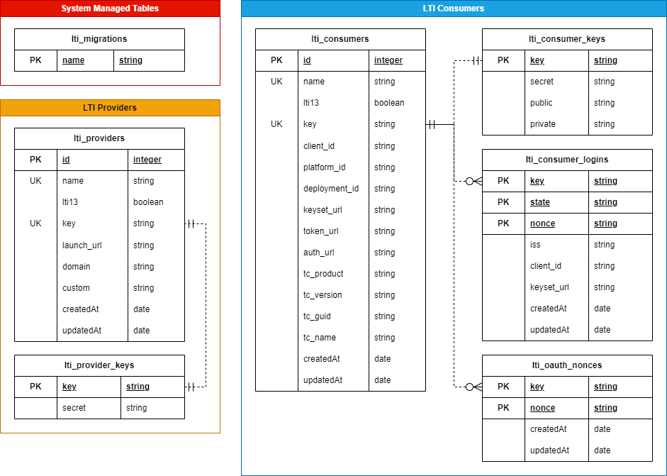

## System Managed Tables

### lti_migrations

This is the migrations table managed by [Umzug](https://github.com/sequelize/umzug). It tracks any changes that must be made to the database schema as future versions are released.

## LTI Consumers

### lti_consumers

This table stores data about LTI Consumers connected to this system. 

* `id` - autogenerated database ID field
* `name` - user-friendly name of the LTI Consumer
* `lti13` - boolean value representing if the LTI Consumer supports LTI 1.3 connections
* `key` - {}Both{} autogenerated internal key used to identify the LTI Consumer
  * This key is used in lieu of the database ID to prevent guessing attacks against sequential values. The key is generated using [nanoid](https://www.npmjs.com/package/nanoid)
* `client_id` - {}LTI 1.3{} client ID provided by the LTI Consumer
* `platform_id` - {}LTI 1.3{} platform ID of the LTI Consumer
* `deployment_id` - {}LTI 1.3{} deployment ID from the LTI Consumer
* `keyset_url` - {}LTI 1.3{} JWKS keyset URL for the LTI Consumer 
* `token_url` - {}LTI 1.3{} Token URL for the LTI Consumer
* `auth_url` - {}LTI 1.3{} Authentication URL for the LTI Consumer
* `tc_product` - {}Both{} {}Auto{} Product Information for the LTI Consumer 
* `tc_version` - {}Both{} {}Auto{} Version of the LTI Consumer
* `tc_guid` - {}Both{} {}Auto{} GUID of the LTI Consumer
* `tc_name` - {}Both{} {}Auto{} Name of the LTI Consumer
* `createdAt` - {}Auto{} creation timestamp
* `updatedAt` - {}Auto{} last updated timestamp

### lti_consumer_keys

This table stores the secrets associated with an LTI Consumer. It is stored in a separate table to prevent accidental modification through the `Consumer` model directly. 

* `key` - {}Auto{} autogenerated internal key used to identify the LTI Consumer
* `secret` - {}LTI 1.0{} shared secret with the LTI Consumer
* `public` - {}LTI 1.3{} public key used in connections with the LTI Consumer
* `private` - {}LTI 1.3{} paired private key used in connections with the LTI Consumer

### lti_consumer_logins

This table stores login requests from LTI Consumers via the LTI 1.3 protocol. Entries in this table are automatically expired after 15-20 minutes (check every 5 minutes, entries older than 15 minutes are removed)

* `key` - {}Auto{} autogenerated internal key used to identify the LTI Consumer
* `state` - {}Auto{} autogenerated internal state shared with the LTI Consumer. Generated using [nanoid](https://www.npmjs.com/package/nanoid)
* `nonce` - {}Auto{} autogenerated internal nonce shared with the LTI Consumer. Generated using [nanoid](https://www.npmjs.com/package/nanoid)
* `iss` - Issuer of the login request from the LTI Consumer
* `client_id` - client ID provided by the LTI Consumer
* `keyset_url` - JWKS keyset URL for the LTI Consumer 
* `createdAt` - {}Auto{} creation timestamp
* `updatedAt` - {}Auto{} last updated timestamp

### lti_oauth_nonces

This table stores nonces provided by the LTI Consumer via the LTI 1.0 protocol. Entries in this table are automatically expired after 15-20 minutes (check every 5 minutes, entries older than 15 minutes are removed)

* `key` - {}Auto{} autogenerated internal key used to identify the LTI Consumer
* `nonce` - nonce value provided by the LTI Consumer in the connection. 
* `createdAt` - {}Auto{} creation timestamp
* `updatedAt` - {}Auto{} last updated timestamp

## LTI Providers

### lti_providers

This table stores information about LTI Tool Providers connected to this system. 

* `id` - autogenerated database ID field
* `name` - user-friendly name of the LTI Tool Provider
* `lti13` - boolean value representing if the LTI Tool Provider supports LTI 1.3 connections.
  * **LTI 1.3 is currently not implemented for LTI Tool Providers**
* `key` - {}Both{} shared key used to identify the LTI Tool Provider
* `launch_url` - {}LTI 1.0{} the launch URL for LTI 1.0 connections to the LTI Tool Provider
* `domain` - {}LTI 1.0{} the base domain name of the LTI Tool Provider
* `custom` - {}LTI 1.0{} custom launch variables provided as part of the LTI 1.0 connection to the LTI Tool Provider
  * **Custom Variables are not currently implemented**
* `use_section` - {}Both{} flag for some LTI Tool Providers that require special handling. This is not implemenetd within this library but may be handy for other uses.
* `createdAt` - {}Auto{} creation timestamp
* `updatedAt` - {}Auto{} last updated timestamp

### lti_provider_keys

This table stores the secrets associated with an LTI Tool Provider. It is stored in a separate table to prevent accidental modification through the `Provider` model directly. 

* `key` - {}Auto{} shared key used to identify the LTI Tool Provider
* `secret` - {}LTI 1.0{} shared secret with the LTI Tool Provider